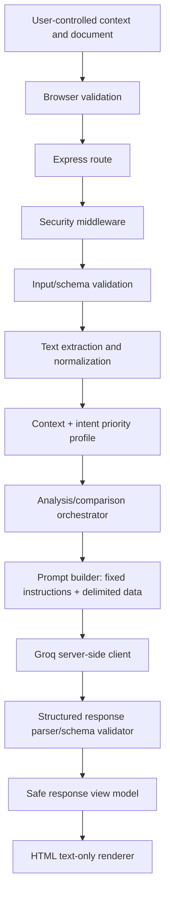
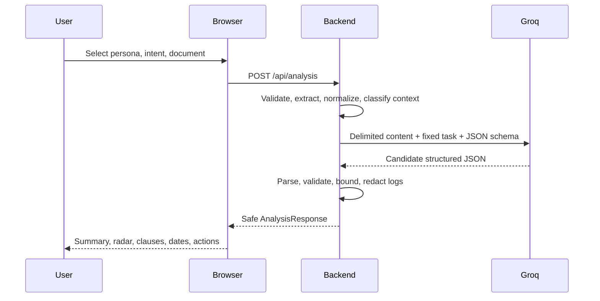
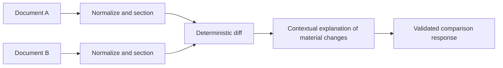
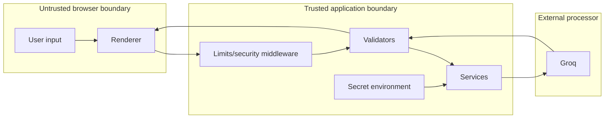
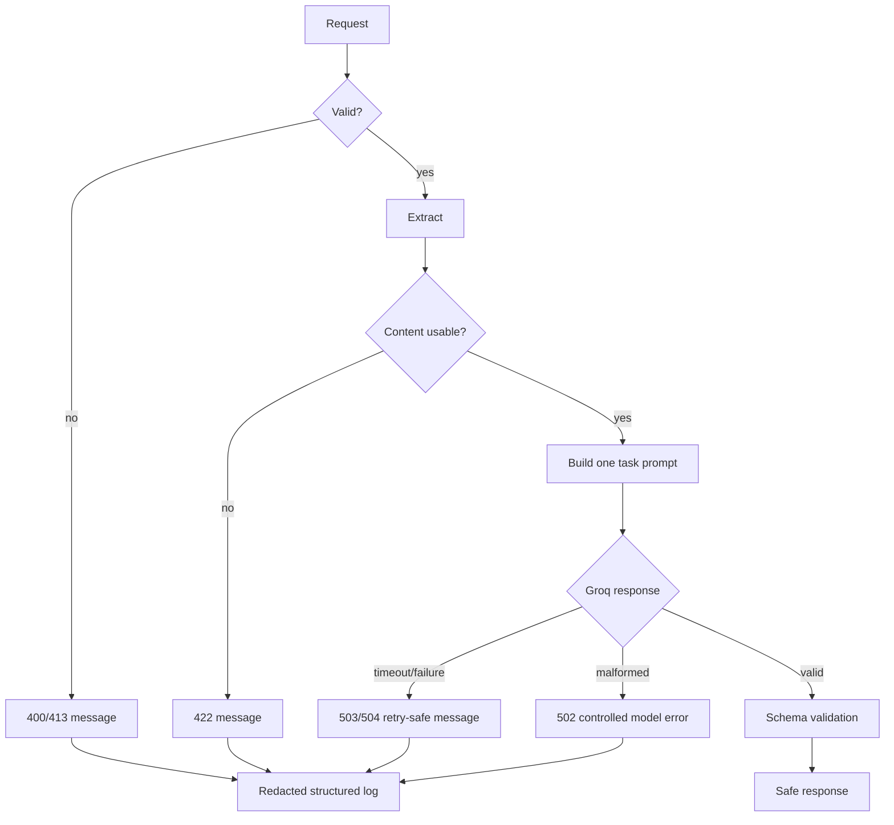
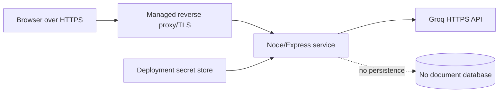

# Architecture

## 1. Scope and principles

LegalLens AI is a transient, server-mediated document-understanding product. The architecture favors explainability, privacy by default, few dependencies, clear boundaries, graceful failure, and a repository below 10 MB. It is not a legal-research or legal-advice system.

## 2. Logical layers

1. **Presentation** — semantic screens, context form, upload/paste, dashboard, clause detail, comparison, status and disclosure components.
2. **Application** — routing, request orchestration, lifecycle, response shaping, rate limits, errors.
3. **Validation** — allowlists, size limits, schema validation, normalization, request IDs.
4. **Document processing** — safe text extraction from supported formats, normalization, section references, chunking.
5. **Context/intent** — allowlisted persona and goal mapped to priorities and output emphasis.
6. **AI orchestration** — task-specific prompts, model call, retry/timeout budget, structured response parsing.
7. **Security** — secret management, security headers, XSS-safe rendering, abuse controls, logging redaction.



## 3. Component architecture

Planned modules (implementation names may be adjusted during Phase 1):

```text
server/
  server.js                 process bootstrap and middleware
  routes/analysisRoutes.js  HTTP contracts only
  routes/comparisonRoutes.js
  routes/healthRoutes.js
  controllers/              request/response coordination
  services/
    documentService.js      extraction, normalization, references, limits
    contextService.js       allowlists and priority profiles
    analysisService.js      single-document use case
    comparisonService.js    two-document normalization and diff use case
    clauseService.js        selected-clause use case
    checklistService.js     optional deterministic post-processing
  ai/
    groqService.js          provider client, timeout, retry budget
    promptService.js        task prompts and delimiters
    schemas.js              response schemas
  validators/               request and model-output validation
  middleware/               rate limit, errors, security, request IDs
  utils/                    logger, redaction, constants
```

The frontend is split by responsibility, not framework: `public/js/api.js`, `state.js`, `forms.js`, `renderers.js`, `accessibility.js`, and `app.js`.

## 4. Request lifecycle

1. Browser validates required persona, intent, and content.
2. Backend assigns a request ID and checks method, content type, size, rate limit, and origin policy where applicable.
3. Validator accepts only enumerated persona/intent values and supported input forms.
4. Document service extracts plain text, rejects empty/oversized content, normalizes whitespace, and assigns section/character references.
5. Context service maps persona and intent to transparent priorities; it never invents facts.
6. Orchestrator selects one task prompt and sends delimited document data to Groq.
7. Groq response is parsed as JSON, validated against the schema, bounded, and normalized. Invalid output is a controlled error, not rendered.
8. Response contains source references and uncertainty language where relevant.
9. Frontend renders values through `textContent`/DOM APIs, never raw AI HTML.
10. Request-specific content is discarded after the response unless a future reviewed storage feature is enabled.

## 5. Data-flow diagrams

### Normal analysis



### Comparison



### Security boundaries



### AI lifecycle and error flow



## 6. Data model

No database is required initially. Runtime DTOs are the contract:

```json
{
  "requestId": "opaque-id",
  "context": {"persona": "employee", "intent": "understand_before_signing"},
  "document": {"documentType": "employment agreement", "language": "en", "sourceLabel": "Document A"},
  "summary": [{"text": "...", "sourceRefs": ["section-3"]}],
  "parties": [{"name": "...", "role": "employee", "sourceRefs": ["section-1"]}],
  "clauses": [{"id": "clause-1", "title": "Termination", "category": "termination", "sourceText": "...", "explanation": "...", "attention": "review_carefully", "uncertainty": "..."}],
  "obligations": [{"party": "employee", "action": "...", "condition": "...", "deadline": "...", "sourceRefs": ["section-4"]}],
  "dates": [{"label": "Notice period", "value": "30 days", "condition": "...", "sourceRefs": ["section-5"]}],
  "attentionItems": [{"level": "high_attention", "title": "...", "whyItMayMatter": "...", "suggestedAction": "...", "sourceRefs": ["section-5"]}],
  "lawyerQuestions": ["..."],
  "checklist": [{"task": "...", "done": false}],
  "disclaimer": "This is informational document assistance, not legal advice."
}
```

`sourceRefs` are references into normalized server-side text, not unsupported claims. Every list is bounded. Unknown values use `unknown` or are omitted; the model is not allowed to guess.

## 7. Implemented API boundaries

The browser never calls Groq. Authenticated clients call `/api/demos` and `/api/analysis`; the analysis controller delegates to services and the AI adapter. The route does not build prompts or parse model output. Comparison and clause-specific endpoints remain future boundaries.

## 7. API boundaries

The browser never calls Groq. Routes should include health, analysis, clause explanation, and comparison. Exact contracts are in [API.md](API.md).

## 8. Deployment architecture

A single Node.js process serves static files and `/api`, behind a platform TLS reverse proxy. Environment variables are injected by the platform. No database, object storage, queue, or worker is needed for the initial scope. A deployment may later split static hosting and API hosting, but the API must remain the only Groq caller.



## 9. Operational controls

Use health checks without secrets, bounded request timeouts, structured redacted logs, request IDs, provider error categorization, dependency pinning, and a documented model configuration. Do not log document text or prompts by default.

## 10. Implementation order

Scaffold and contracts → static UX shell → validators/document service → mocked orchestration → Groq adapter → analysis dashboard → clause/comparison flows → hardening → tests/accessibility audit → deployment.
