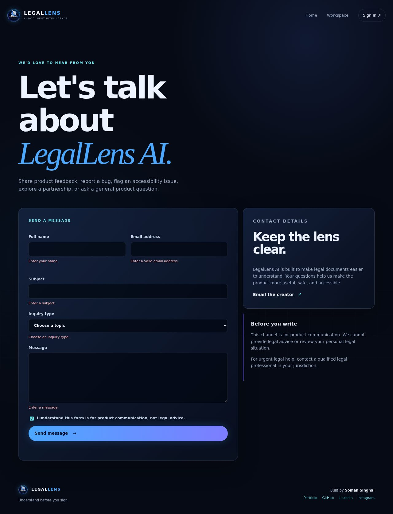
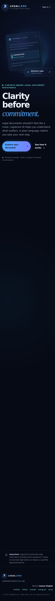
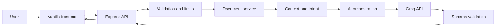

# LegalLens AI

<p align="center"></p>

<p align="center"><strong>UNDERSTAND BEFORE YOU SIGN</strong></p>

> Context-aware legal-document assistance for clearer decisions and better conversations with legal professionals.

## 🎥 Product Demo

The application includes a real authenticated judge flow and deterministic Playwright recording path. A compressed demonstration recording is available at [`docs/demo/legallens-ai-demo.webm`](docs/demo/legallens-ai-demo.webm).

[](docs/demo/legallens-ai-demo.webm)

**▶ [Watch Product Demo](docs/demo/legallens-ai-demo.webm)**

## 📸 Product Screenshots

Visual regression baselines live under `tests/e2e/*-snapshots/`, with optimized showcase images under [`docs/screenshots/`](docs/screenshots/). They cover the landing page, login, authenticated workspace, Contact validation, desktop, and mobile layouts.

### Landing & Authentication

| Landing | Login |
|---|---|
|  |  |

### Workspace & Contact

| Workspace | Contact validation |
|---|---|
|  |  |

### Mobile Experience



## 🚀 Judge Quick Start

1. Open LegalLens AI.
2. Sign in with Google when OAuth is configured, or use the configured Judge Demo credentials.
3. Open the authenticated workspace.
4. Choose a persona and intent.
5. Select a synthetic evaluation agreement or paste document text.
6. Run analysis with a configured Groq key.
7. Review Summary, Attention Radar, clauses, obligations, dates, questions, and checklist.
8. Visit Contact for product feedback or accessibility issues.

## Contact

Visit [`/contact.html`](public/contact.html) for the product contact form. Delivery requires server-side SMTP configuration; without it, the form returns a clear configuration message rather than falsely claiming success.

> **Understand Before You Sign**

LegalLens AI is a context-aware legal-document understanding assistant for employees, freelancers, students, small-business owners, and other people reviewing agreements. It translates document language into plain-language explanations, surfaces clauses that deserve attention, extracts obligations and dates, compares versions, and prepares questions for a qualified legal professional.

## Important limitation

LegalLens AI provides legal information and document assistance. It does **not** provide legal advice, act as a lawyer, determine whether a clause is legal or enforceable, or replace a qualified legal professional. Attention levels are informational review priorities, not legal conclusions.

## Problem and solution

Legal documents are often difficult to understand, and the most relevant issues depend on a person's situation and goal. LegalLens AI uses the selected persona and intent as explicit inputs to a server-side analysis pipeline, so an employee and a freelancer can receive different priorities from the same document.

## Challenge alignment

This project addresses the **AI for Legal Assistance & Access** vertical through explainable document assistance rather than a generic chatbot. See [PRODUCT.md](PRODUCT.md) for user journeys and the requirement matrix.

## Planned capabilities

- Persona and intent selection
- Text/document intake with strict validation
- Plain-language summary and document-type identification
- Clause, obligation, party, date, deadline, and condition extraction
- Informational Attention Radar: **HIGH ATTENTION**, **REVIEW CAREFULLY**, **INFORMATIONAL**
- Clause explorer with source reference and questions to consider
- Version-to-version comparison: unchanged, added, removed, changed
- Lawyer preparation questions
- Contextual action checklist
- Accessible, responsive document-analysis workspace

## Architecture at a glance

The planned implementation is a small Node.js and Express server serving a vanilla HTML/CSS/JavaScript client. The browser calls only the backend. The backend validates input, extracts text, builds a structured prompt, calls Groq using server-only credentials, validates the model response, and returns a safe JSON view model.



Full architecture: [ARCHITECTURE.md](ARCHITECTURE.md).

## Technology and repository constraints

- HTML5, CSS3, vanilla JavaScript
- Node.js and Express.js
- Groq through a backend-only service
- No database for the initial demo; documents are processed in memory and not intentionally persisted
- Minimal dependencies; no React unless a later reviewed decision changes this
- No model files, datasets, `node_modules`, build output, logs, or secrets in Git
- Target repository size: comfortably below 10 MB

## Local development

Requirements: Node.js 18.18 or newer.

```bash
npm install
cp .env.example .env
npm start
# open http://localhost:3000
```

Useful commands:

```bash
npm run dev   # Node watch mode
npm test      # deterministic tests; no Groq key required
```

The current product exposes authenticated demo-document listing and `POST /api/analysis`; Groq is called only from the backend and is disabled in tests. Comparison, clause-specific explanation, and persistent history remain later roadmap phases. Configure `GROQ_API_KEY` and `GROQ_MODEL` to enable production analysis. Environment variables are documented in [API.md](API.md) and `.env.example`.

## Security, accessibility, and testing

- Server-side secret handling, schema validation, file limits, rate limiting, safe text rendering, and prompt-injection defenses are mandatory.
- Semantic HTML, keyboard operation, focus visibility, contrast, labels, non-color status cues, and meaningful loading/error states are acceptance criteria.
- Unit, integration, security, edge-case, and manual accessibility tests are planned. See [TESTING.md](TESTING.md).

## Demo access and judge workflow

The authenticated judge workflow is available at `/login.html`. Configure the limited demo account only on the server through `DEMO_EMAIL` and `DEMO_PASSWORD`; do not place the real password in this repository or frontend code. Judges sign in, enter the protected workspace, choose persona and intent, load a synthetic agreement, and run the same backend analysis path used for pasted documents. Live analysis requires the configured Groq environment variables; tests use a deterministic fixture only.

## Branding and SEO

The supplied official logo is stored as `public/assets/legallens-ai-logo.jpg` and is used in the landing page, login, dashboard, footer, favicon, and social metadata. `robots.txt` and `sitemap.xml` use the `__DEPLOYMENT_ORIGIN__` placeholder until a production domain is known. Replace that placeholder during deployment; do not publish it unchanged.

## Privacy assumptions

The first version is transient: no account system, database, document history, or analytics containing document content. Content may be sent to Groq to perform the requested analysis, subject to the selected provider's terms and deployment configuration. The UI must disclose this before submission. Production use requires a reviewed retention, jurisdiction, consent, and provider-data policy.

## Future improvements

Human-reviewed jurisdiction-specific resources, encrypted opt-in storage, authenticated workspaces, redaction, OCR, stronger document parsers, citations to authoritative sources, provider abstraction, multilingual support, and independent privacy/security review.

## Creator

Built by **Soman Singhal**.

- [Portfolio](https://soman-singhal.vercel.app)
- [GitHub](https://github.com/somansinghal)
- [LinkedIn](https://in.linkedin.com/in/soman-singhal)
- [Instagram](https://www.instagram.com/_somansinghal/)
- Email: [somansinghal06@gmail.com](mailto:somansinghal06@gmail.com)

## End-to-end testing

Playwright is a development-only dependency for deterministic browser QA. Install dependencies and the Chromium browser, then run:

```bash
npm install
npx playwright install chromium
npm run test:e2e
npm run test:e2e:headed
npm run test:e2e:report
```

Screenshots, videos, traces, and reports are written to `artifacts/` and excluded from Git. The current E2E suite covers the implemented landing, login, protected workspace, social links, accessibility basics, and logout journey. AI analysis, clause exploration, comparison, and lawyer-preparation tests will be added when those product features are implemented; the suite does not invent fake results.

## Documentation map

- [ARCHITECTURE.md](ARCHITECTURE.md) — system, component, data-flow, security-boundary, deployment diagrams
- [API.md](API.md) — endpoint contracts and errors
- [SECURITY.md](SECURITY.md) — threat model and controls
- [AI.md](AI.md) — prompts, structured output, safety, and limitations
- [PRODUCT.md](PRODUCT.md) — personas, journeys, requirements, and evaluator alignment
- [TESTING.md](TESTING.md) — test architecture and manual checklist
- [DECISIONS.md](DECISIONS.md) — architecture decision records
- [ROADMAP.md](ROADMAP.md) — phased implementation and release plan
